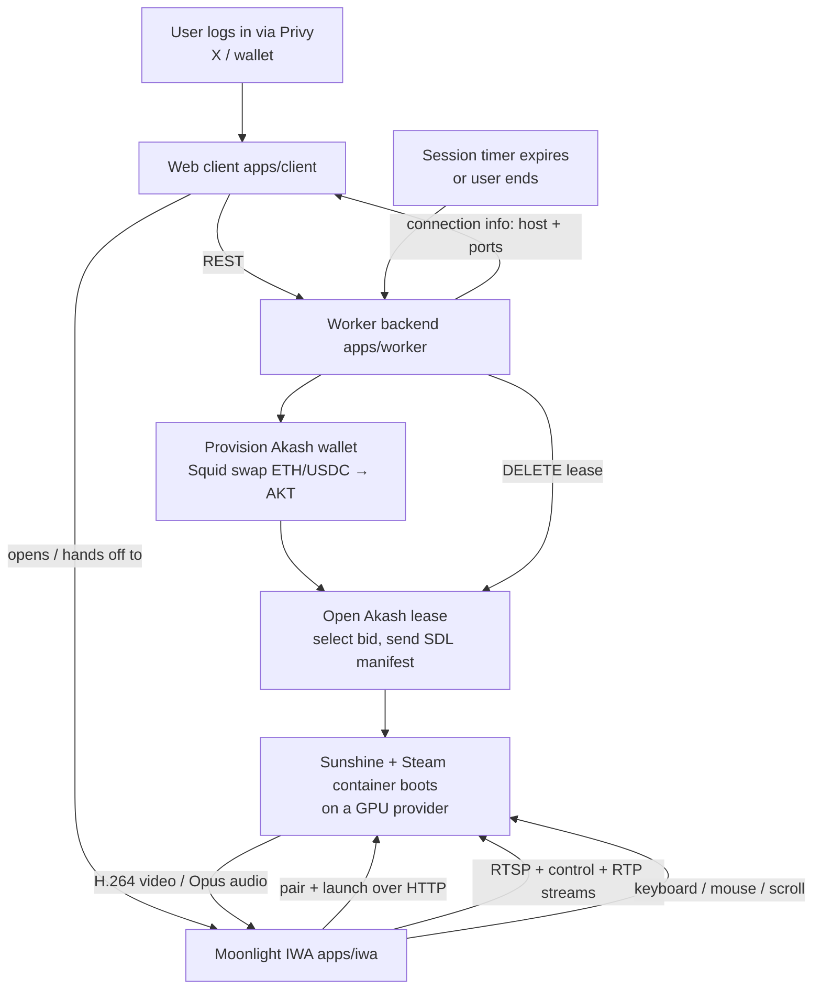

# BaseHack — Architecture & How It Works

> This document describes the **system as actually implemented** in this repo. For the
> product vision and roadmap, see [`PLAN.md`](./PLAN.md). Where the two differ, this
> document reflects the code on disk.

---

## 1. What this is

BaseHack is a **decentralized cloud-gaming platform**. A user logs in, pays, and a
GPU game-streaming host is provisioned on demand on the [Akash Network](https://akash.network);
the user then plays the game **entirely in their browser** with mouse/keyboard/audio/video
streamed in real time.

There are really two distinct systems in this repo, joined at the hip:

1. **The orchestration platform** — a Next.js web app + a Node backend that handle auth,
   payments, and provisioning a [Sunshine](https://docs.lizardbyte.dev/projects/sunshine)
   GPU container on Akash. (Sunshine is the open-source GameStream host; the container image
   itself lives in a separate `game-stream-container` repo.)

2. **The streaming client** — the technically novel part. A browser-based
   [Moonlight](https://moonlight-stream.org) client that speaks NVIDIA's GameStream protocol
   by compiling the real C protocol library (`moonlight-common-c`) to **WebAssembly**, and
   wiring its socket/video/audio/input I/O to modern browser APIs (Direct Sockets, WebCodecs,
   Web Audio, Pointer Lock, Keyboard Lock).

The protocol engine is **not** a TypeScript reimplementation — it is the upstream C library,
unmodified except for a platform shim, running in the browser via Emscripten + pthreads.

---

## 2. Repo layout

Monorepo managed with **pnpm workspaces** + **Turborepo** (`pnpm@9`, Node ≥ 20). Because
`pnpm` is not on PATH in this environment, commands are run through Corepack: `corepack pnpm …`.

```
game-stream/
├── apps/
│   ├── client/     Next.js (App Router) web app — login, funding, session UI
│   ├── worker/     Hono (Node) backend — auth, sessions, Akash deploy, Squid swaps
│   └── iwa/        The Moonlight streaming client (Vite). Packaged as a Chrome IWA.
├── packages/
│   ├── protocol/   moonlight-common-c compiled to WASM + a TypeScript wrapper API
│   └── shared/     Shared types/constants (session types, GPU catalog, ports, chains)
├── infra/docker/   Container assets
├── sdl/            Akash SDL (deployment manifest) inputs
├── PLAN.md         Product vision / roadmap
└── ARCHITECTURE.md This file
```

| Workspace | Package name | Dev port | Stack |
|---|---|---|---|
| `apps/client` | `@basehack/client` | 3000 | Next.js, Privy, viem/wagmi |
| `apps/worker` | `@basehack/worker` | 4000 | Hono, Drizzle ORM, Akash SDK, Squid |
| `apps/iwa` | `@basehack/iwa` | 3001 | Vite, TypeScript, WebCodecs/Web Audio/Direct Sockets |
| `packages/protocol` | `@basehack/protocol` | — | C (Emscripten/WASM) + TypeScript |
| `packages/shared` | `@basehack/shared` | — | TypeScript types |

---

## 3. End-to-end lifecycle



The platform half (auth → pay → provision) produces a **connection descriptor** (provider IP
+ the Sunshine port map). That descriptor is handed to the streaming client, which then runs
the entire GameStream protocol itself.

---

## 4. The streaming client (the interesting part)

### 4.1 Layering

```
┌──────────────────────────────────────────────────────────────────┐
│ apps/iwa  (browser, TypeScript)                                    │
│                                                                    │
│  SessionManager  ── orchestrates one stream                        │
│    ├─ PairingClient        HTTP(S) pairing + app launch (Sunshine) │
│    ├─ MoonlightSession ────┐                                       │
│    ├─ TcpTransport         │  Direct Sockets (or dev proxy)         │
│    ├─ UdpTransport         │                                        │
│    ├─ VideoStreamDecoder   │  WebCodecs VideoDecoder → Canvas       │
│    ├─ AudioPlayer          │  WebCodecs AudioDecoder → Web Audio    │
│    ├─ KeyboardInput        │  window key events → VK codes          │
│    └─ MouseInput           │  Pointer Lock + Keyboard Lock + FS     │
│                            │                                        │
├────────────────────────────┼───────────────────────────────────────┤
│ packages/protocol (TS wrapper)                                     │
│    MoonlightSession  ·  createRuntimeTransport  ·  loadMoonlightModule │
├────────────────────────────┼───────────────────────────────────────┤
│ packages/protocol (WASM)   ▼                                       │
│    moonlight-common-c  +  ENet  +  platform shim (C)               │
│    RTSP/SDP · control stream · RTP video (FEC) · audio · input     │
└────────────────────────────────────────────────────────────────────┘
```

The **C core owns the protocol**: RTSP/SDP handshake, the ENet reliable-UDP control stream,
RTP video depacketization + loss/FEC + IDR feedback, audio packet reassembly, and input
packet encoding/encryption. **TypeScript owns the browser**: sockets, decoding, rendering,
audio output, and input capture.

### 4.2 The WASM bridge boundary

`packages/protocol/js/socket-bridge.js` is the Emscripten "JS library" linked into the module.
It defines the C↔JS boundary in three categories:

- **Async I/O** (`socket_connect`, `socket_send`, `socket_recv`, `socket_sendto`,
  `socket_recvfrom`, `enet_udp_recv`, `crypto_encrypt`, `crypto_decrypt`) — annotated
  `__proxy:'sync'` + `__async:true`. These run on worker threads but are **proxied to the
  main thread** (where the Direct Sockets transport lives) and the worker blocks on a futex
  until the JS promise resolves.
- **Fire-and-forget** (`socket_close`, `ml_dbg`) — `__proxy:'async'`.
- **Host callbacks** (`ml_stage_*`, `ml_connection_*`, `ml_video_*`, `ml_audio_*`) —
  `__proxy:'sync'` so they execute on the main thread, where `Module.moonlightCallbacks`
  is defined.

On the C side, three small files implement the shim:

| File | Role |
|---|---|
| `platform/moonlight_bridge.c` | Exposes `ml_start_connection`, input senders, etc.; registers moonlight's video/audio/connection callback structs that forward into the JS bridge. |
| `platform/platform_web.c` | Stubs POSIX platform calls; `__wrap_recv` / `__wrap_sendto` reroute libc socket calls into the JS bridge using a synthetic address scheme. |
| `platform/platform_web_crypto.c` | Routes AES-GCM crypto to the JS bridge. |
| `platform/enet_web.c` | Implements the ENet socket API (`enet_socket_*`) over the Direct Sockets bridge instead of BSD sockets. |

### 4.3 Threading model (why pthreads, not ASYNCIFY)

moonlight-common-c spins up real OS threads for its control/video/audio receive loops. The
build therefore compiles **everything with `-pthread`** and links with a worker pool
(`-sPTHREAD_POOL_SIZE=24`), turning those threads into Web Workers backed by a
`SharedArrayBuffer`. Key consequences (see `packages/protocol/CMakeLists.txt`):

- The connection handshake runs on a **worker thread**; `ml_start_connection` returns
  immediately and the real result arrives later via the `onConnectionResult` callback
  (`MoonlightSession.start()` awaits a promise wired to that callback).
- Worker threads may block (`-sALLOW_BLOCKING_ON_MAIN_THREAD=1` permits a stray main-thread
  wait to warn rather than abort); the main thread never blocks.
- `SharedArrayBuffer` requires the page to be **cross-origin isolated**, so the dev server
  sends `Cross-Origin-Opener-Policy` / `Cross-Origin-Embedder-Policy` headers. The module is
  built as an **ES6 module for both `web` and `worker`** environments so spawned workers can
  re-import `moonlight.js`.

The linker also `--wrap`s `recv`, `sendto`, and the full `enet_socket_*` family so no raw
BSD socket call can escape the bridge.

### 4.4 Transport: Direct Sockets, with a dev fallback

`packages/protocol/src/transport.ts` (`createRuntimeTransport`) maps **synthetic file
descriptors** (starting at 100) to TCP/UDP handles and exposes `connect/send/recv/sendTo/
recvFrom/recvFromTimed/close` to the WASM core.

The actual sockets come from `apps/iwa/src/transport/{tcp,udp}.ts`, which have two modes:

- **Packaged IWA**: uses the real **Direct Sockets API** (`TCPSocket` / `UDPSocket`) to talk
  straight to Sunshine — no relay.
- **Plain-Chrome dev** (`http://localhost:3001`): Direct Sockets aren't available and Sunshine
  uses self-signed TLS + raw UDP that a browser `fetch` can't do, so requests fall back to
  **Vite dev-server middleware** (`apps/iwa/vite.config.ts`) at `/__moonlight_tcp`,
  `/__moonlight_udp`, and `/__moonlight_http`. The Node middleware opens the real socket and
  relays bytes (base64) over HTTP.

> **UDP batching:** a naive one-datagram-per-HTTP-request dev proxy capped throughput far
> below a 60fps stream's ~1800 pkt/s and caused multi-second lag. The dev path therefore uses
> a `recvbatch` op: the server blocks until ≥1 datagram is queued, then returns up to 256 at
> once. (In a packaged IWA this is moot — UDP is direct.)

### 4.5 Pairing & launch

Before the C core starts, `apps/iwa/src/pairing/client.ts` performs Sunshine's HTTP pairing
handshake (AES + signed-cert challenge/response via `crypto.ts`, using `node-forge` /
`@peculiar/x509`). Sunshine shows a PIN; in the automated product flow the platform agent
POSTs it to Sunshine's `/api/pin` (port 47990) so the user never types it. After pairing,
the client calls **launch** to start the app (Steam Big Picture, or a specific Steam appid),
which yields the `rtspSessionUrl` and the RI (remote-input) AES key/IV. These are handed to
`MoonlightSession.create()/start()`, which the C core uses for the RTSP handshake and to
encrypt input.

### 4.6 Video

`onVideoFrame` delivers encoded H.264 access units from the C depacketizer. `VideoStreamDecoder`
(`apps/iwa/src/video/decoder.ts`) feeds them to a **WebCodecs `VideoDecoder`** (hardware
accelerated), flushing on IDR boundaries; decoded `VideoFrame`s are drawn by `CanvasRenderer`
onto a 2D canvas sized to the stream.

### 4.7 Audio

moonlight-common-c does **not** decode Opus — it hands us encoded Opus frames via
`onAudioPacket`, with format info (`sampleRate`, `channelCount`, `samplesPerFrame`) via
`onAudioFormat`. `AudioPlayer` (`apps/iwa/src/audio/player.ts`) decodes them with a **WebCodecs
`AudioDecoder`** (`codec: 'opus'`) and schedules the resulting PCM on a **Web Audio** playhead
with a small (~60 ms) jitter buffer. Because Chrome blocks audio until a user gesture, the
`AudioContext` is `resume()`d (idempotently) from the existing mouse/keyboard gesture callbacks.

### 4.8 Input

- **Keyboard** (`input/keyboard.ts`): listeners are attached to **`window`** (a `<canvas>` is
  not keyboard-focusable, so listening on it silently drops every key). Browser `code` values
  are mapped to Windows Virtual-Key codes and sent via `sendKeyboard`.
- **Mouse** (`input/mouse.ts`): uses the **Pointer Lock API** for relative-motion deltas.
- **Escape & system keys**: a tap of Escape normally just exits pointer lock and can't reach
  the game. To forward it (for menus/SteamOS), clicking the canvas enters **fullscreen** and
  calls the **Keyboard Lock API** (`navigator.keyboard.lock()`) — the cloud-gaming pattern.
  The "release capture" gesture becomes **press-and-hold Escape** (which exits fullscreen; a
  `fullscreenchange` handler then frees the cursor + keyboard).

Input events flow `DOM → SessionManager → MoonlightSession.send* → ml_send_* (C) →` encrypted
input packet over the control stream → Sunshine → host uinput devices → the game.

### 4.9 The TypeScript wrapper API (`packages/protocol/src`)

- `loadMoonlightModule()` — instantiates the Emscripten module, attaches the runtime transport
  and host callbacks.
- `MoonlightSession` — the public class. `create()/start()/stop()`, `sendKeyboard`,
  `sendMouseMove/Button/Scroll`, `requestIdrFrame`, `getStats`. It marshals JS args into WASM
  memory (`Allocations`) and calls the exported `ml_*` C functions via `ccall`.
- `createRuntimeTransport()` — the fd registry described in §4.4.
- `types.ts` — the shared TS types for frames, formats, callbacks, transport handles.

---

## 5. Building the WASM core

`packages/protocol` vendors `moonlight-common-c` (fetched/pinned by
`scripts/fetch-moonlight-common-c.mjs`) and builds it with Emscripten:

```sh
corepack pnpm --filter @basehack/protocol fetch:moonlight   # vendor sources + ENet submodule
corepack pnpm --filter @basehack/protocol configure          # emcmake cmake -B build
corepack pnpm --filter @basehack/protocol build:wasm         # → dist/moonlight.js + moonlight.wasm
```

Notable build flags (`CMakeLists.txt`): excludes upstream `PlatformSockets.c`/`PlatformCrypto.c`
(replaced by the web shim), exports the `ml_*` functions + `malloc/free`, links `socket-bridge.js`
as a `--js-library`, `--wrap`s libc/ENet socket calls, and emits a modularized ES6 module with
memory growth from a 64 MB initial heap.

> **License note:** `moonlight-common-c` is **GPL-3.0**. Distributing a client that links the
> resulting WASM must comply with GPL-3.0 for the combined work.

---

## 6. The backend (`apps/worker`)

A **Hono** HTTP server (default `:4000`) backed by **Drizzle ORM**. Auth is a Privy bearer
token verified on every request (`auth/privy-verify.ts`).

Endpoints (`src/index.ts`):

| Method & path | Purpose |
|---|---|
| `GET /health`, `GET /config` | Liveness; whether demo (skip-swap) mode is on |
| `POST /auth/sync` | Link Privy user ↔ Base wallet; provision an Akash wallet |
| `GET /users/me` | Current user + wallet addresses |
| `POST /sessions` | Create a session row |
| `GET /sessions/:id` | Poll session status/connection info |
| `POST /sessions/:id/quote` · `/route` · `/swap` | Squid cross-chain funding (ETH/USDC → AKT) |
| `POST /sessions/:id/deploy` · `/demo-deploy` | Open the Akash lease (real vs pre-funded wallet) |
| `DELETE /sessions/:id` | Tear down the lease |

A session advances through an explicit **state machine** (`sessions/state-machine.ts`):

```
authenticated → akash_provisioning → spec_select → deposit_quote →
swap_in_progress → swap_complete → deploying → bid_wait → lease_created →
manifest_sent → lease_ready → ready → tearing_down → closed
                                  (any state → failed)
```

Supporting modules: `deploy/` (Akash SDL render, bid selection, manifest send, lease watch),
`swap/` (Squid pricing + route), `wallets/` (custody + Akash wallet provisioning), and
`sessions/teardown.ts` (a shutdown handler that closes leases so compute isn't left running).

---

## 7. The web client (`apps/client`)

A **Next.js App Router** app (default `:3000`). It handles Privy login (X/Twitter or wallet),
funding UI (deposit + Squid swap progress), GPU/resource spec selection, and the session
connection card. It talks to the worker via `lib/api.ts`, and ultimately hands a connection
descriptor to the Moonlight IWA (which renders the actual stream).

The IWA accepts that descriptor either via URL params (`?host=&port=&autoconnect=1`) or a
`postMessage({ type: 'basehack:connect', connectionInfo, sessionId, authToken })` — see
`apps/iwa/src/main.ts`. A manual connect form is also available for direct testing.

---

## 8. Shared package (`packages/shared`)

Single source of truth for cross-app types/constants: `session-types.ts` (session/swap/specs
shapes), `gpu-catalog.ts`, `squid-chains.ts`, and `sunshine-ports.ts`:

```
TCP: 47984, 47989, 47990, 48010
UDP: 47998, 47999, 48000, 48002, 48010
```

| Port | Proto | Used for |
|---|---|---|
| 47984 / 47989 | TCP | GameStream HTTPS / HTTP (serverinfo, pairing, launch) |
| 47990 | TCP | Sunshine web UI / `/api/pin` (auto-pairing) |
| 48010 | TCP+UDP | RTSP / control |
| 47998 / 47999 / 48000 / 48002 | UDP | Video / audio / control / input RTP streams |

> Not all Akash providers reliably forward UDP — provider selection must filter for UDP-capable
> nodes, or the stream can't start.

---

## 9. The host container (separate repo, summarized)

Each session runs an ephemeral, single-session **Sunshine + Steam (Proton)** container with
host networking and GPU passthrough. Sunshine creates virtual keyboard/mouse "passthrough"
uinput devices when a Moonlight client connects; a small relay materializes the device nodes
inside the container so its headless Xorg can hot-plug them.

> **Operational gotcha (input passthrough):** input only reaches the game if the container's
> Xorg and the host udev rule agree on the **seat** of the passthrough devices. If a host
> reboot causes `systemd-udevd` to tag the devices `ID_SEAT=seat-sunshine` while Xorg runs on
> the default seat, Xorg ignores them ("No input driver specified") and keyboard/mouse do
> nothing **even though the browser captures and forwards them correctly**. The fix is on the
> container/host side (match the seat), not in this client.

---

## 10. Running it locally (dev)

```sh
corepack pnpm install

# Streaming client only (manual connect to a Sunshine host):
corepack pnpm --filter @basehack/iwa dev      # http://localhost:3001

# Full platform:
corepack pnpm --filter @basehack/worker dev    # http://localhost:4000
corepack pnpm --filter @basehack/client dev    # http://localhost:3000
# or: corepack pnpm dev  (turbo runs them together)
```

To test the stream directly: open `http://localhost:3001`, enter the Sunshine host IP (leave
port blank for the 47989 default), connect, submit the PIN to the host, then click the video
once to capture mouse/keyboard/audio. The dev server proxies the otherwise-impossible raw
TCP/UDP/TLS calls; a packaged IWA does them directly via Direct Sockets.

> **Prereq for `dist/moonlight.{js,wasm}`:** the WASM core must be built once (see §5) and its
> output served at the IWA's web root (`/moonlight.js`, `/moonlight.wasm`).

---

## 11. Constraints & gotchas

- **Chrome-only.** Direct Sockets, IWA packaging, and Keyboard Lock are Chromium features.
- **Cross-origin isolation required** for the WASM pthreads (`SharedArrayBuffer`) — COOP/COEP
  headers must be present.
- **Self-signed TLS / raw UDP** can't be done from a normal browser tab — hence the dev proxy;
  production relies on the packaged IWA + Direct Sockets.
- **UDP throughput** on the dev proxy must be batched, or video lags badly.
- **Remote-desktop tools (e.g. AnyDesk)** interact awkwardly with Pointer Lock (relative mouse
  deltas under a locked/injected cursor); keyboard still works since it's captured on `window`.
- **Akash UDP forwarding** and **GPU availability** are real provider-side variables.
- **GPL-3.0** obligations apply to the vendored protocol core.
```
